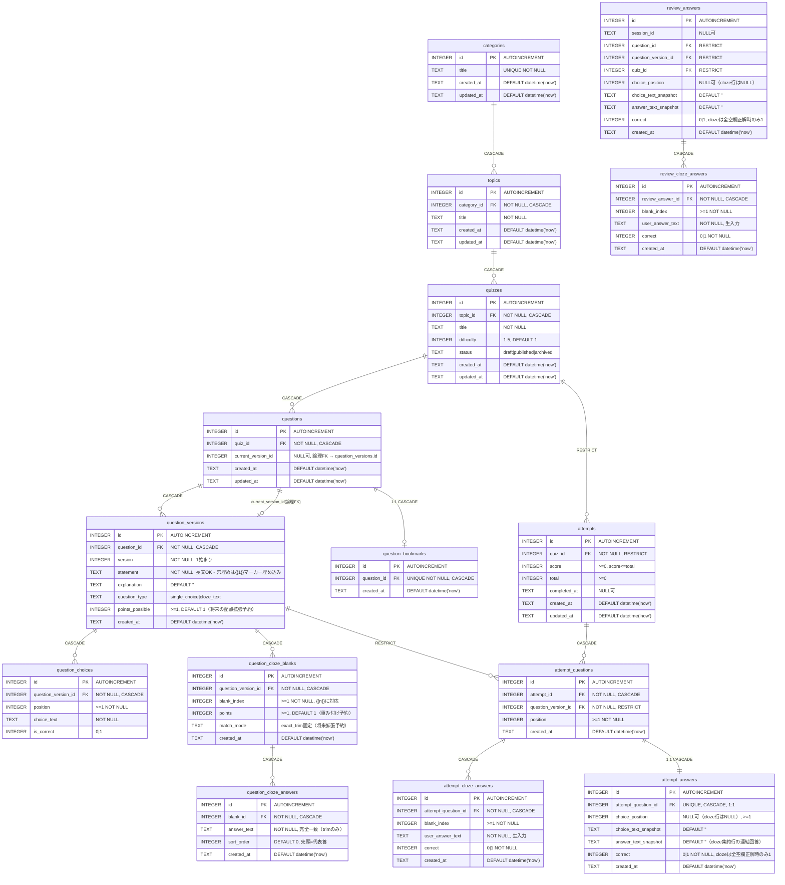

# DB ER図

`migrations/0001_schema.sql` が正本。D1 (SQLite) / `wrangler.jsonc` の `migrations_dir: migrations` から適用される。

## リレーションシップ一覧

| 親 → 子                                        | FK                                                  | ON DELETE                 | 備考                                                                                        |
| ---------------------------------------------- | --------------------------------------------------- | ------------------------- | ------------------------------------------------------------------------------------------- |
| categories → topics                            | topics.category_id                                  | CASCADE                   | カテゴリ削除で配下も消える                                                                  |
| topics → quizzes                               | quizzes.topic_id                                    | CASCADE                   | UNIQUE(topic_id, title)                                                                     |
| quizzes → questions                            | questions.quiz_id                                   | CASCADE                   | 問題本体は薄い行。文面は versions に持つ                                                    |
| questions → question_versions                  | question_versions.question_id                       | CASCADE                   | 編集時は UPDATE せず新規 version を INSERT。UNIQUE(question_id, version)                    |
| questions → question_versions (current)        | questions.current_version_id → question_versions.id | — (DDL上のFKなし・論理FK) | `seed.sql` のように UPDATE で最新版を指す                                                   |
| question_versions → question_choices           | question_choices.question_version_id                | CASCADE                   | N択・○×に耐える設計。UNIQUE(question_version_id, position)                                  |
| quizzes → attempts                             | attempts.quiz_id                                    | RESTRICT                  | 学習履歴はコンテンツ削除で消さない。CHECK(score <= total)                                   |
| attempts → attempt_questions                   | attempt_questions.attempt_id                        | CASCADE                   | 出題スナップショット。UNIQUE(attempt_id, position), UNIQUE(attempt_id, question_version_id) |
| question_versions → attempt_questions          | attempt_questions.question_version_id               | RESTRICT                  | 出題時点の版を固定参照                                                                      |
| attempt_questions → attempt_answers            | attempt_answers.attempt_question_id                 | CASCADE                   | UNIQUE制約で 1:1 (出題1行に回答1行)。cloze行はchoice_position=NULL＋明細参照                |
| question_versions → question_cloze_blanks      | question_cloze_blanks.question_version_id           | CASCADE                   | 版ごとに空欄定義。UNIQUE(question_version_id, blank_index)。statementの{{n}}に対応          |
| question_cloze_blanks → question_cloze_answers | question_cloze_answers.blank_id                     | CASCADE                   | 1空欄N正答（今は1行運用）。UNIQUE(blank_id, answer_text)                                    |
| attempt_questions → attempt_cloze_answers      | attempt_cloze_answers.attempt_question_id           | CASCADE                   | 空欄単位の回答明細・部分点。UNIQUE(attempt_question_id, blank_index)                        |
| review_answers → review_cloze_answers          | review_cloze_answers.review_answer_id               | CASCADE                   | 復習の空欄単位明細。UNIQUE(review_answer_id, blank_index)                                   |
| questions → question_bookmarks                 | question_bookmarks.question_id                      | CASCADE                   | 1問1ブックマーク。UNIQUE(question_id)。解答履歴と分離                                       |

## UNIQUE / CHECK 一覧

- categories.title: UNIQUE
- topics: UNIQUE(category_id, title)
- quizzes: UNIQUE(topic_id, title), difficulty 1-5, status IN (draft, published, archived)
- question_versions: UNIQUE(question_id, version), question_type IN (single_choice, cloze_text), points_possible >= 1
- question_choices: UNIQUE(question_version_id, position), position >= 1, is_correct IN (0,1)
- question_cloze_blanks: UNIQUE(question_version_id, blank_index), blank_index >= 1, points >= 1, match_mode = 'exact_trim'
- question_cloze_answers: UNIQUE(blank_id, answer_text)
- attempts: CHECK(score >= 0), CHECK(total >= 0), CHECK(score <= total)
- attempt_questions: UNIQUE(attempt_id, position), UNIQUE(attempt_id, question_version_id)
- attempt_answers: UNIQUE(attempt_question_id), choice_position IS NULL OR >= 1, correct IN (0,1)
- attempt_cloze_answers: UNIQUE(attempt_question_id, blank_index), blank_index >= 1, correct IN (0,1)
- review_answers: choice_position IS NULL OR >= 1（cloze行はNULL）
- review_cloze_answers: UNIQUE(review_answer_id, blank_index), blank_index >= 1, correct IN (0,1)
- question_bookmarks: UNIQUE(question_id)

## 穴埋め運用ルール（アプリ層責務・DBでは強制しない）

- `single_choice` → choices>0 かつ blanks=0、`cloze_text` → choices=0 かつ blanks>=1。
- `statement` 中の `{{n}}` 集合と `blanks.blank_index` 集合が一致すること。
- 採点は `trim(user_input) = answer_text` の完全一致。`correct(集約) = 全空欄正解時のみ1`。
- `attempts.score/total` は問題数分母のまま（空欄分母の率は明細から集計）。
- `unified_answer_history` は問題単位のまま。空欄単位は `unified_cloze_blank_history` を見る。
