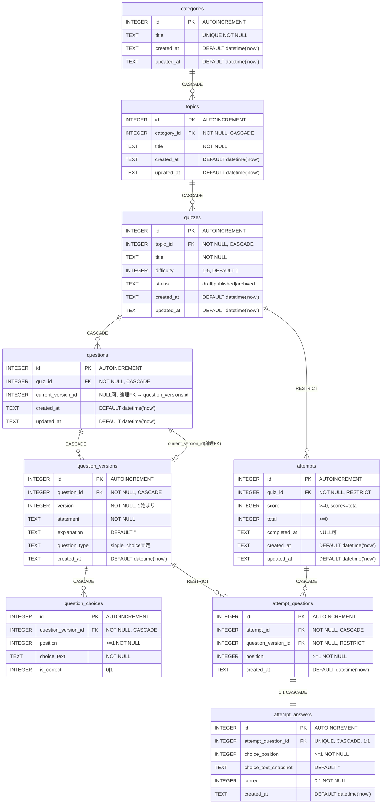

# DB ER図

`migrations/0001_schema.sql` が正本。D1 (SQLite) / `wrangler.jsonc` の `migrations_dir: migrations` から適用される。

## リレーションシップ一覧

| 親 → 子                                 | FK                                                  | ON DELETE                 | 備考                                                                                        |
| --------------------------------------- | --------------------------------------------------- | ------------------------- | ------------------------------------------------------------------------------------------- |
| categories → topics                     | topics.category_id                                  | CASCADE                   | カテゴリ削除で配下も消える                                                                  |
| topics → quizzes                        | quizzes.topic_id                                    | CASCADE                   | UNIQUE(topic_id, title)                                                                     |
| quizzes → questions                     | questions.quiz_id                                   | CASCADE                   | 問題本体は薄い行。文面は versions に持つ                                                    |
| questions → question_versions           | question_versions.question_id                       | CASCADE                   | 編集時は UPDATE せず新規 version を INSERT。UNIQUE(question_id, version)                    |
| questions → question_versions (current) | questions.current_version_id → question_versions.id | — (DDL上のFKなし・論理FK) | `seed.sql` のように UPDATE で最新版を指す                                                   |
| question_versions → question_choices    | question_choices.question_version_id                | CASCADE                   | N択・○×に耐える設計。UNIQUE(question_version_id, position)                                  |
| quizzes → attempts                      | attempts.quiz_id                                    | RESTRICT                  | 学習履歴はコンテンツ削除で消さない。CHECK(score <= total)                                   |
| attempts → attempt_questions            | attempt_questions.attempt_id                        | CASCADE                   | 出題スナップショット。UNIQUE(attempt_id, position), UNIQUE(attempt_id, question_version_id) |
| question_versions → attempt_questions   | attempt_questions.question_version_id               | RESTRICT                  | 出題時点の版を固定参照                                                                      |
| attempt_questions → attempt_answers     | attempt_answers.attempt_question_id                 | CASCADE                   | UNIQUE制約で 1:1 (出題1行に回答1行)                                                         |

## UNIQUE / CHECK 一覧

- categories.title: UNIQUE
- topics: UNIQUE(category_id, title)
- quizzes: UNIQUE(topic_id, title), difficulty 1-5, status IN (draft, published, archived)
- question_versions: UNIQUE(question_id, version), question_type = 'single_choice'
- question_choices: UNIQUE(question_version_id, position), position >= 1, is_correct IN (0,1)
- attempts: CHECK(score >= 0), CHECK(total >= 0), CHECK(score <= total)
- attempt_questions: UNIQUE(attempt_id, position), UNIQUE(attempt_id, question_version_id)
- attempt_answers: UNIQUE(attempt_question_id), choice_position >= 1, correct IN (0,1)
